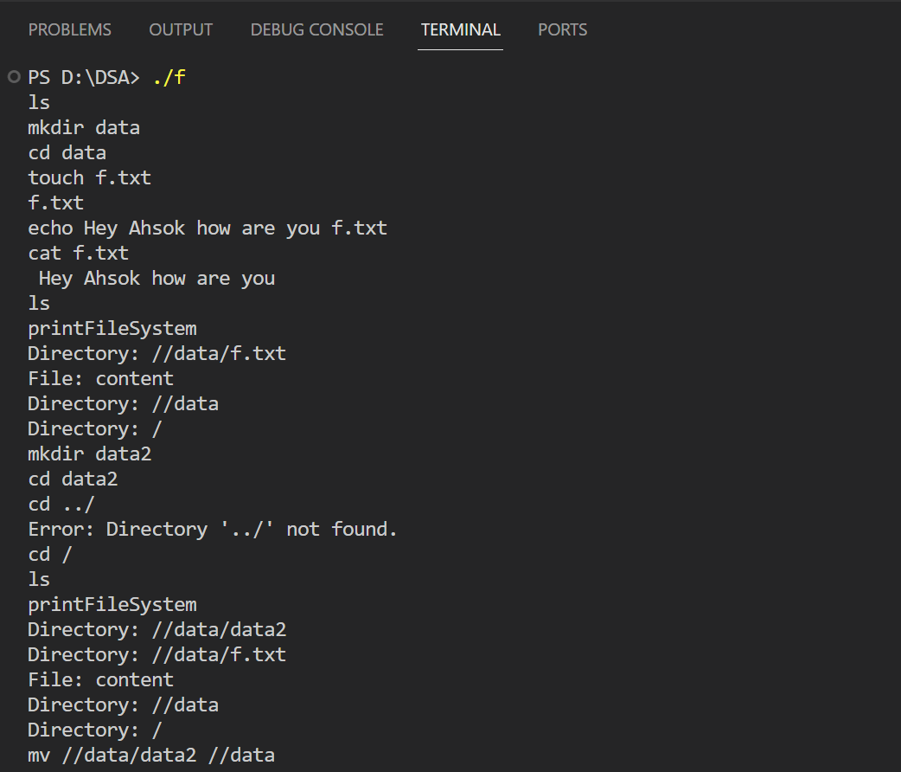
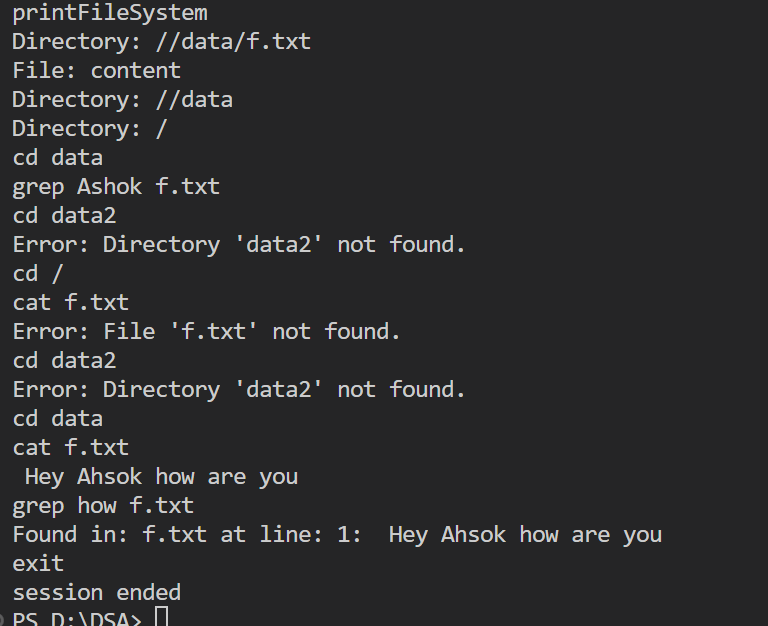

# hiring-assignments

[Software Internship assignment (2023 -24)](software-intern.md)

# Running C++ InMemoryFile System Functions with Docker

## Prerequisites

- [Docker](https://www.docker.com/get-started) installed on your machine.

## Steps

1. **Clone the Repository:**

   ```bash
   git clone https://github.com/sainiAshokKumar/Inito-assignment.git)https://github.com/sainiAshokKumar/Inito-assignment.git
   cd Inito-assignment
   ```
2. **Make sure docker deamon is running**
3. **Build the docker image**

   ``` docker build -t filesystem . ```
4. **Run Docker Container**

   ``` docker run filesystem ```

5. **Interact with the filesystem**
6. It supports:
      - mkdir
      - cd
      - ls
      - touch
      - cat
      - echo
      - grep
      - cp
      - mv
      - rm
8. State is not saved
9. Sample output in local enviornment




## Implementation Details 
# In-Memory File System Implementation

## Introduction

This in-memory file system is implemented in C++ to support various file system functionalities. The implementation includes operations such as creating, changing, listing directory contents, creating and manipulating files, searching using grep.

## Data Structures Used

### `InMemoryFileSystem` Class

The main class representing the in-memory file system. It contains the following key attributes:

- `currentDirectory`: A string representing the current working directory.
- `fileSystem`: An unordered map representing the file system structure. It maps directory paths to a nested unordered map, which maps file names to file contents.
-  Amortised time-complexity of using an unordered_map is O(1) that's why it is preferred. Since we do now have many collisions so we prefer this. 

### Methods

1. **mkdir(string& directoryName):**
   - Creates a new directory in the file system.

2. **cd(string& path):**
   - Changes the current working directory.
   - Supports navigation to the parent directory (`..`), moving to the root directory (`/`), and navigating to a specified absolute path.

3. **ls(string& path):**
   - Lists the contents of the current directory or a specified directory.

4. **grep(string& pattern, string& fileName):**
   - Searches for a specified pattern in the content of a file.

5. **cat(string& fileName):**
   - Displays the contents of a file.

6. **touch(cstring& fileName):**
   - Creates a new empty file.

7. **echo(string& text, string& fileName):**
   - Writes text to a file.

8. **mv(string& source,string& destination):**
   - Moves a file or directory to another location.

9. **cp(string& source, string& destination):**
   - Copies a file or directory to another location.

10. **rm(string& path):**
    - Removes a file or directory.

### `getAbsolutePath` Function

It is a private helper function within the `InMemoryFileSystem` class that returns the absolute path given a relative path.

## Design Decisions

- **In-Memory Representation:**
  The file system is represented entirely in memory using a nested unordered map to mimic the directory structure.

- **Directory Navigation:**
  The `cd` method supports navigation to the parent directory using `..`, moving to the root directory using `/`, and navigating to a specified absolute path.

- **Error Handling:**
  The implementation includes basic error handling for cases such as attempting to create a directory or file that already exists.

- **Content Storage:**
  File contents are stored in the in-memory file system. The `echo` and `grep` methods operate on this stored content. NO STATE is SAVED.

- **Containerization:**
  The implementation can be easily containerized using Docker. A Dockerfile is provided to encapsulate the C++ program and its dependencies.

## Conclusion

The in-memory file system provides a basic yet functional representation of file system operations. It is designed to be modular, with separation of concerns among different functions and an easy-to-use Docker containerization for deployment.


## Further links
1. [ManageMyShow](https://github.com/sainiAshokKumar/ManageMyShow)
2. [AcademicXPro](https://github.com/sainiAshokKumar/AcademicXPro)
